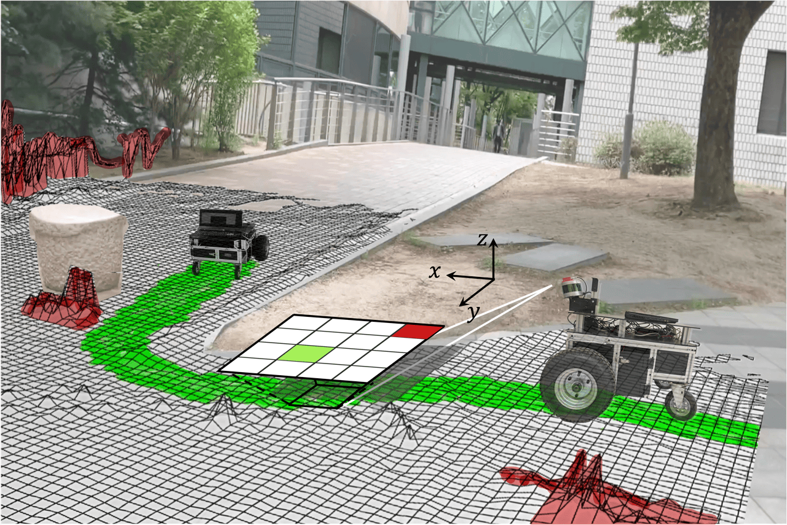

<div align="center">
    <!-- Title -->
    <h1>LeSTA</h1>
    <h3>Learning Self-supervised Traversability with Navigation Experiences of Mobile Robots</h3>
    <a href="https://github.com/Ikhyeon-Cho/LeSTA"></a>
    <a href="https://github.com/Ikhyeon-Cho/LeSTA"></a>
    <a href="https://github.com/Ikhyeon-Cho/LeSTA"></a>
    <a href="https://ieeexplore.ieee.org/document/10468651"></a>
    <a href="https://ras.papercept.net/conferences/conferences/ICRAX24/program/ICRAX24_ContentListWeb_4.html#WeAT5.3"></a>
</div>

<div align="center">
    <br>
    <p>
        🛠️ <a href="#lesta_ros">Installation</a> | 
        🎥 <a href="">Video</a> | 
        📖 <a href="https://ieeexplore.ieee.org/document/10468651">Paper</a> | 
        📁 <a href="#sample-datasets">Dataset</a>
    </p>
    <br>
    <p align='center'>
        
        
    </p>

**LeSTA directly learns robot-specific traversability in a self-supervised manner** by using a short period of manual driving experience.
</div>

[paperlink]:https://ieeexplore.ieee.org/document/10468651
[projectlink]:https://github.com/Ikhyeon-Cho/LeSTA
[datasetlink]:https://github.com/Ikhyeon-Cho/urban-traversability-dataset


## :loudspeaker: News & Updates

- **2024.07.30**: Our paper is accepted for presentation at **IEEE ICRA@40** in Rotterdam, Netherlands
- **2024.02.29**: Our paper is accepted by **IEEE Robotics and Automation Letters** ([IEEE RA-L](https://ieeexplore.ieee.org/document/10468651))
- **2024.02.19**: We release the [urban-traversability-dataset](https://github.com/Ikhyeon-Cho/urban-traversability-dataset) for learning terrain traversability in urban environments


## :rocket: What's in this repo
- **C++ package for LeSTA** with ROS interface ([lesta_ros](https://github.com/Ikhyeon-Cho/LeSTA/tree/master/lesta_ros/))
  - Traversability label generation from LiDAR-reconstructed height map
  - Traversability inference/mapping using a learned network

- **PyTorch scripts** for training LeSTA model ([pylesta](https://github.com/Ikhyeon-Cho/LeSTA/tree/master/lesta_training/))


## :hammer_and_wrench: Installation

Our project is built on [ROS](https://www.ros.org/), successfully tested on the following setup.
- Ubuntu 20.04 / ROS Noetic
- PyTorch 2.2.2 / LibTorch 2.6.0

### lesta_ros

1. Install [Grid Map](https://github.com/ANYbotics/grid_map) library for height mapping:
   ```bash
   sudo apt install ros-noetic-grid-map -y
   ```

2. Install [LibTorch](https://pytorch.org/cppdocs/installing.html) (choose one option):
   <details>
   <summary><b>CPU-only version (Recommended for easier setup)</b></summary>

   ```bash
   wget https://download.pytorch.org/libtorch/cpu/libtorch-cxx11-abi-shared-with-deps-2.6.0%2Bcpu.zip -P ~/Downloads
   sudo unzip ~/Downloads/libtorch-cxx11-abi-shared-with-deps-2.6.0+cpu.zip -d /opt
   rm ~/Downloads/libtorch-cxx11-abi-shared-with-deps-2.6.0+cpu.zip
   ```
   </details>

   <details>
   <summary>GPU-supported version (e.g. CUDA 11.8)</summary>

   ```bash
   # To be updated...
   ```
   </details>
   
3. Build [lesta_ros](https://github.com/Ikhyeon-Cho/LeSTA/tree/master/lesta_ros/) package:
   ```bash
   cd ~/ros_ws/src
   git clone https://github.com/Ikhyeon-Cho/LeSTA.git
   cd ..
   catkin build lesta
   source devel/setup.bash
   ```

:bulb: **Notes:**
- We recommend starting without GPU processing. The network effectively runs on a single CPU core.
- If you are interested in height map reconstruction, see [height_mapping](https://github.com/Ikhyeon-Cho/height_mapping) for more details.

<br>

### pylesta

1. Install [PyTorch](https://pytorch.org/get-started/locally/) (choose one option):
   <details>
   <summary><b>CPU-only setup</b></summary>
   <br>

   > We recommend using a virtual environment for PyTorch installation.

   **Conda**
      ```bash
      conda create -n lesta python=3.8 -y
      conda activate lesta
      conda install pytorch=2.2 torchvision cpuonly tensorboard -c pytorch -y
      ```

   **Virtualenv**
   ```bash
    virtualenv -p python3.8 lesta-env
    source lesta-env/bin/activate
    pip install torch==2.2 torchvision tensorboard --index-url https://download.pytorch.org/whl/cpu
   ```
   </details>

   <details>
   <summary>CUDA setup</summary>
   <br>

   > We recommend using a virtual environment for PyTorch installation.

   **Conda**
   ```bash
   conda create -n lesta python=3.8 -y
   conda activate lesta
   conda install pytorch=2.2 torchvision tensorboard cudatoolkit=11.8 -c pytorch -c conda-forge -y
   ```

   **Virtualenv**
   ```bash
   virtualenv -p python3.8 lesta-env
   source lesta-env/bin/activate
   pip install torch==2.2 torchvision tensorboard --index-url https://download.pytorch.org/whl/cu118
   ```
   </details>

2. Install [pylesta](https://github.com/Ikhyeon-Cho/LeSTA/tree/master/pylesta/) package:

   ```bash
   # Make sure your virtual environment is activated
   cd LeSTA
   pip install -e pylesta
   ```

> :whale: If you are familiar with Docker, see [here](#using-docker) for easier CUDA environment setup.

## :rocket: Run the package
You have two options:
   1. **Train the traversability model with your own robot** from scratch
   2. **Use pre-trained model** to predict traversability
   > ⚠️ **Note:** 
   > **For optimal performance, we highly recommend training the model with your own robot's data.** The robot's unique sensor setup and motion dynamics are crucial for accurate traversability predictions, yet the configuration of our robot might differ from yours. For details on our settings, visit [urban-traversability-dataset](https://github.com/Ikhyeon-Cho/urban-traversability-dataset) repo.

<br>

The entire training-to-deployment pipeline consists of three steps:
1. **Label Generation**: Generate the traversability label from the dataset.
2. **Model Training**: Train the traversability model with the generated labels.
3. **Traversability Estimation**: Prediction/mapping of the terrain traversability with your own robot.

> For rapid testing of the project, you can use checkpoints in [#model-zoo](#model-zoo) and directly go to [#traversability-estimation](#3-traversability-estimation).

<br>

### 1. Label Generation
#### Launch ROS node
```bash
roslaunch lesta label_generation.launch
```
#### Generate labels with rosbag
> **Note:** See [#sample datasets](#sample-datasets) for example rosbag files.
```bash
rosbag play {your-rosbag}.bag --clock -r 3
```
#### Save traversability labels
```bash
rosservice call /lesta/save_label_map "training_set" ""  # {filename} {directory}
```
> The labeled height map will be saved as a single `training_set.pcd` file in the root directory of the package.

<br>

### 2. Model Training
#### Launch training script with parameters
> **Note:** See `pylesta/configs/lesta.yaml` for more training details.
```bash
# Make sure your virtual environment is activated
cd LeSTA
python pylesta/tools/train.py --dataset "training_set.pcd"
```

<br>

### 3. Traversability Estimation

#### Prerequisites
Configure `model_path` variable in `lesta_ros/config/*_node.yaml` with your model checkpoint.
- **trav_prediction_node.yaml**
- **trav_mapping_node.yaml**
> **Note:** See [#model-zoo](#sample-datasets) for our pre-trained checkpoints.

#### Launch ROS node
We provide two options for traversability estimation:

<div align="center">
  
  
  <p><i>Left: Robot-centric traversability prediction. Right: Real-time traversability mapping.</i></p>

<table>
  <tr>
    <th width="400">1. Traversability Prediction</th>
    <th width="400">2. Traversability Mapping</th>
  </tr>
  <tr>
    <td>
      <ul>
        <li><strong>Robot-centric local traversability</strong></li>
        <li>Suitable for local motion planning</li>
        <li>Score traversability from model inference</li>
      </ul>
    </td>
    <td>
      <ul>
        <li><strong>Global traversability mapping</strong></li>
        <li>Suitable for global path planning</li>
        <li>Update traversability scores over time</li>
      </ul>
    </td>
  </tr>
</table>

</div>

**How to run:**
1. For traversability prediction:
   ```bash
   roslaunch lesta traversability_prediction.launch
   ```

2. For traversability mapping:
   ```bash
   roslaunch lesta traversability_mapping.launch
   ```

#### Test the node with rosbag
```bash
rosbag play {your-rosbag}.bag --clock -r 2
```

## Sample datasets

- Download rosbag files to test the package. The datasets below are configured to run with the default settings:

  - **Campus road Dataset** [[Google Drive](https://drive.google.com/drive/folders/1C_jPeGpr_7867v7znTjca3hy4acE0uBJ?usp=drive_link)]

  - **Parking lot Dataset** [[Google Drive](https://drive.google.com/drive/folders/1C_jPeGpr_7867v7znTjca3hy4acE0uBJ?usp=drive_link)]

> See [urban-traversability-dataset](https://github.com/Ikhyeon-Cho/urban-traversability-dataset) repository for more data samples.

## Model Zoo

<table>
  <tr>
    <th>Model</th>
    <th>Description</th>
    <th>Environment</th>
    <th>Features</th>
    <th>Download</th>
  </tr>
  <tr>
    <td><strong>LeSTA-parking-lot</strong></td>
    <td>The model trained on parking lot dataset</td>
    <td>Urban (parking lot with low-height curbs)</td>
    <td>
      <ul>
        <li>Step</li>
        <li>Slope</li>
        <li>Roughness</li>
        <li>Curvature</li>
      </ul>
    </td>
    <td>
      <a href="https://drive.google.com/drive/folders/1BDJsOmfyDAkVGlSTNL2RdWG2kM7nwt0C?usp=drive_link">
      </a>
    </td>
  </tr>
  <tr>
    <td><strong>LeSTA-campus-road</strong></td>
    <td>The model trained on campus road dataset</td>
    <td>Urban (campus roads with flat terrain and hills)</td>
    <td>
      <ul>
        <li>Step</li>
        <li>Slope</li>
        <li>Roughness</li>
        <li>Curvature</li>
      </ul>
    </td>
    <td>
      <a href="https://drive.google.com/drive/folders/1BDJsOmfyDAkVGlSTNL2RdWG2kM7nwt0C?usp=drive_link">
      </a>
    </td>
  </tr>
</table>

## Using Docker
To be updated...

## Issues
- **Artifacts from dynamic objects**:
  - We currently implemented a raycasting-based approach to remove artifacts from dynamic objects.
  - This is crucial for accurate static terrain representation, which directly impacts prediction quality.
  - Yet, not enough to handle all artifacts.
  - We are working on more robust methods to detect and filter dynamic objects in real-time.

- **Performance degradation due to noisy height mapping**:
  - Traversability is learned and predicted from a dense height map.
  - The dense height map is accomplished by concatenating many sparse LiDAR scans.
  - A good SLAM / 3d pose estimation is required to get a good height map.
  - In typical settings, [FAST-LIO2](https://github.com/hku-mars/FAST_LIO), [LIO-SAM](https://github.com/TixiaoShan/LIO-SAM), or [CT-ICP](https://github.com/jedeschaud/ct_icp) are good starting points.
  - We are working on improving the height mapping accuracy.


## 📝 Citation

Thank you for citing [our paper](https://ieeexplore.ieee.org/document/10468651) if this helps your research project:

> Ikhyeon Cho, and Woojin Chung. **'Learning Self-Supervised Traversability With Navigation Experiences of Mobile Robots: A Risk-Aware Self-Training Approach'**, *IEEE Robotics and Automation Letters, Feb. 2024*.

```bibtex
@article{cho2024learning,
  title={Learning Self-Supervised Traversability With Navigation Experiences of Mobile Robots: A Risk-Aware Self-Training Approach}, 
  author={Cho, Ikhyeon and Chung, Woojin},
  journal={IEEE Robotics and Automation Letters}, 
  year={2024},
  volume={9},
  number={5},
  pages={4122-4129},
  doi={10.1109/LRA.2024.3376148}
}
```

You can also check [the paper](https://ieeexplore.ieee.org/document/9561394) of our baseline:

> Hyunsuk Lee, and Woojin Chung. **'A Self-Training Approach-Based Traversability Analysis for Mobile Robots in Urban Environments'**, *IEEE International Conference on Robotics and Automation (ICRA), 2021*.

```bibtex
@inproceedings{lee2021self,
  title={A self-training approach-based traversability analysis for mobile robots in urban environments},
  author={Lee, Hyunsuk and Chung, Woojin},
  booktitle={2021 IEEE International Conference on Robotics and Automation (ICRA)},
  pages={3389--3394},
  year={2021},
  organization={IEEE}
}
```

## License

This project is licensed under the Apache License 2.0 - see the [LICENSE](LICENSE) file for details.

## Contact

For any questions or feedback, feel free to contact us! or publish an issue on [GitHub](https://github.com/Ikhyeon-Cho/LeSTA/issues).
- [Ikhyeon Cho](https://github.com/Ikhyeon-Cho) :   tre0430`at`korea.ac.kr
