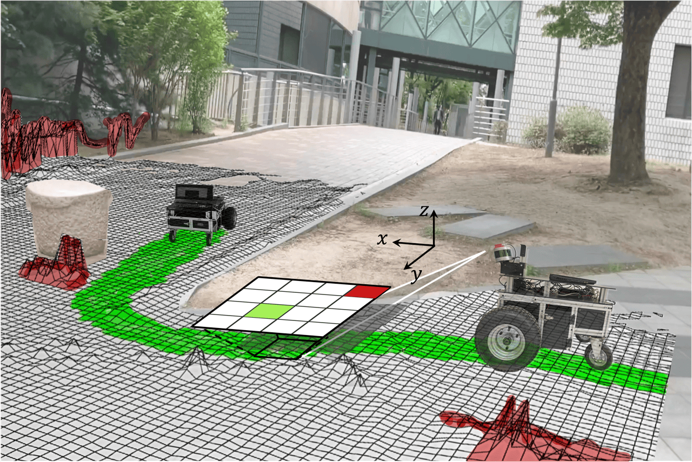

<div align="center">

<!-- Title -->
## LeSTA: Learning Self-supervised Traversabiltiy with Navigation Experiences of Mobile Robots

<div>
<br>

💻 Installation | 🎥 Video | 📖 [Paper (RA-L)](https://ieeexplore.ieee.org/document/10468651) | 📁 [Dataset](https://github.com/Ikhyeon-Cho/urban-traversability-dataset)

**🔥 README will be updated soon (About 1 week). Stay tuned! 🔥**
<br>

<p align='center'>
    
    
</p>
<div align="left">
<div>

## What is LeSTA
**LeSTA aims to learn robot-specific traversability in a self-supervised manner by using a short period of manual driving.**

## How to use LeSTA


<!-- 

## Installation
### Dependencies

This software is built on the Robotic Operating System ([ROS](https://www.ros.org/)), which needs to be [installed](http://wiki.ros.org) first. Additionally, the Traversability Mapping depends on following software:

- [Grid Map](https://github.com/anybotics/grid_map) (grid map library for mobile robots)
- [Point Cloud Library (PCL)](http://pointclouds.org/) (point cloud processing),
- [Eigen](http://eigen.tuxfamily.org) (linear algebra library).
- [isr ros_utils](https://github.com/Ikhyeon-Cho/isr_ros_utils) (custom ROS Wrapper library for convenient usage of roscpp interfaces).

### Building

In order to install the Traversability Mapping, clone the latest version from this repository into your catkin workspace and compile the package using ROS.

    cd catkin_workspace/src
    git clone https://github.com/Ikhyeon-Cho/traversability_mapping.git
    cd ../
    catkin build -DCMAKE_BUILD_TYPE=Release

## Basic Usage
In order to get the Traversability Mapping to run with your robot, you will need to adapt a few parameters. These are specifically the parameter files in `config` folder.

To start with local traversability mapping, use command

    roslaunch traversability_mapping run.launch


### Node: local_terrain_mapping

This is the main Robot-Centric Elevation Mapping node. It uses the distance sensor measurements and the pose and covariance of the robot to generate an elevation map with variance estimates. -->


<!-- #### Subscribed Topics -->

<!-- * **`/points`** ([sensor_msgs/PointCloud2])

    The distance measurements.

* **`/tf`** ([tf/tfMessage])

    The transformation tree.


#### Published Topics

* **`elevation_map`** ([grid_map_msgs/GridMap])

    The entire (fused) elevation map. It is published periodically (see `fused_map_publishing_rate` parameter) or after the `trigger_fusion` service is called.

* **`elevation_map_raw`** ([grid_map_msgs/GridMap])

    The entire (raw) elevation map before the fusion step.


#### Services

* **`trigger_fusion`** ([std_srvs/Empty])

    Trigger the fusing process for the entire elevation map and publish it. For example, you can trigger the map fusion step from the console with

        rosservice call /elevation_mapping/trigger_fusion

* **`get_submap`** ([grid_map_msgs/GetGridMap])

    Get a fused elevation submap for a requested position and size. For example, you can get the fused elevation submap at position (-0.5, 0.0) and size (0.5, 1.2) described in the odom frame and save it to a text file form the console with

        rosservice call -- /elevation_mapping/get_submap odom -0.5 0.0 0.5 1.2 []

* **`get_raw_submap`** ([grid_map_msgs/GetGridMap])

    Get a raw elevation submap for a requested position and size. For example, you can get the raw elevation submap at position (-0.5, 0.0) and size (0.5, 1.2) described in the odom frame and save it to a text file form the console with

        rosservice call -- /elevation_mapping/get_raw_submap odom -0.5 0.0 0.5 1.2 []

* **`clear_map`** ([std_srvs/Empty])

    Initiates clearing of the entire map for resetting purposes. Trigger the map clearing with

        rosservice call /elevation_mapping/clear_map

* **`masked_replace`** ([grid_map_msgs/SetGridMap])

    Allows for setting the individual layers of the elevation map through a service call. The layer mask can be used to only set certain cells and not the entire map. Cells containing NAN in the mask are not set, all the others are set. If the layer mask is not supplied, the entire map will be set in the intersection of both maps. The provided map can be of different size and position than the map that will be altered. An example service call to set some cells marked with a mask in the elevation layer to 0.5 is

        rosservice call /elevation_mapping/masked_replace "map:
          info:
            header:
              seq: 3
              stamp: {secs: 3, nsecs: 80000000}
              frame_id: 'odom'
            resolution: 0.1
            length_x: 0.3
            length_y: 0.3
            pose:
              position: {x: 5.0, y: 0.0, z: 0.0}
              orientation: {x: 0.0, y: 0.0, z: 0.0, w: 0.0}
          layers: [elevation,mask]
          basic_layers: [elevation]
          data:
          - layout:
              dim:
              - {label: 'column_index', size: 3, stride: 9}
              - {label: 'row_index', size: 3, stride: 3}
              data_offset: 0
            data: [0.5, 0.5, 0.5, 0.5, 0.5, 0.5, 0.5, 0.5, 0.5]
          - layout:
              dim:
              - {label: 'column_index', size: 3, stride: 9}
              - {label: 'row_index', size: 3, stride: 3}
              data_offset: 0
            data: [0, 0, 0, .NAN, .NAN, .NAN, 0, 0, 0]
          outer_start_index: 0
          inner_start_index: 0"

* **`save_map`** ([grid_map_msgs/ProcessFile])

    Saves the current fused grid map and raw grid map to rosbag files. Field `topic_name` must be a base name, i.e. no leading slash character (/). If field `topic_name` is empty, then `elevation_map` is used per default. Example with default topic name

        rosservice call /elevation_mapping/save_map "file_path: '/home/integration/elevation_map.bag' topic_name: ''"

* **`load_map`** ([grid_map_msgs/ProcessFile])

    Loads the fused grid map and raw grid map from rosbag files. Field `topic_name` must be a base name, i.e. no leading slash character (/). If field `topic_name` is empty, then `elevation_map` is used per default. Example with default topic name

        rosservice call /elevation_mapping/load_map "file_path: '/home/integration/elevation_map.bag' topic_name: ''"

* **`reload_parameters`** ([std_srvs/Trigger])

  Triggers a re-load of all elevation mapping parameters, can be used to online reconfigure the parameters. Example usage:

        rosservice call /elevation_mapping/reload_parameters {}

* **`disable_updates`** ([std_srvs/Empty])

    Stops updating the elevation map with sensor input. Trigger the update stopping with

        rosservice call /elevation_mapping/disable_updates {}

* **`enable_updates`** ([std_srvs/Empty])

    Start updating the elevation map with sensor input. Trigger the update starting with

        rosservice call /elevation_mapping/enable_updates {}

#### Parameters

* **`DEPRECATED point_cloud_topic`** (string, default: "/points")

    The name of the distance measurements topic. Use input_sources instead. 
    
* **`input_sources`** (list of input sources, default: none)

    Here you specify your inputs to elevation mapping, currently "pointcloud" inputs are supported. 
    
    Example configuration:
    ```yaml
    input_sources:
        front: # A name to identify the input source
          type: pointcloud # Supported types: pointcloud
          topic: /lidar_front/depth/points
          queue_size: 1
          publish_on_update: true # Wheter to publish the elevation map after a callback from this source. 
        rear:
          type: pointcloud
          topic: /lidar_rear/depth/points
          queue_size: 5
          publish_on_update: false
    ```
    No input sources can be configured with an empty array:
    ```yaml
    input_sources: []
    ```
* **`robot_pose_topic`** (string, default: "/robot_state/pose")

    The name of the robot pose and covariance topic.

* **`base_frame_id`** (string, default: "/robot")

    The id of the robot base tf frame.

* **`map_frame_id`** (string, default: "/map")

    The id of the tf frame of the elevation map.

* **`track_point_frame_id`** (string, default: "/robot")

    The elevation map is moved along with the robot following a *track point*. This is the id of the tf frame in which the track point is defined.

* **`track_point_x`**, **`track_point_y`**, **`track_point_z`** (double, default: 0.0, 0.0, 0.0)

    The elevation map is moved along with the robot following a *track point*. This is the position of the track point in the `track_point_frame_id`.

* **`robot_pose_cache_size`** (int, default: 200, min: 0)

    The size of the robot pose cache.

* **`min_update_rate`** (double, default: 2.0)

    The mininum update rate (in Hz) at which the elevation map is updated either from new measurements or the robot pose estimates.

* **`fused_map_publishing_rate`** (double, default: 1.0)

    The rate for publishing the entire (fused) elevation map.

* **`relocate_rate`** (double, default: 3.0)

    The rate (in Hz) at which the elevation map is checked for relocation following the tracking point.

* **`length_in_x`**, **`length_in_y`** (double, default: 1.5, min: 0.0)

    The size (in m) of the elevation map.

* **`position_x`**, **`position_y`** (double, default: 0.0)

    The position of the elevation map center, in the elevation map frame. This parameter sets the planar position offsets between the generated elevation map and the frame in which it is published (`map_frame_id`). It is only useful if no `track_point_frame_id` parameter is used.

* **`resolution`** (double, default: 0.01, min: 0.0)

    The resolution (cell size in m/cell) of the elevation map.

* **`min_variance`**, **`max_variance`** (double, default: 9.0e-6, 0.01)

    The minimum and maximum values for the elevation map variance data.

* **`mahalanobis_distance_threshold`** (double, default: 2.5)

    Each cell in the elevation map has an uncertainty for its height value. Depending on the Mahalonobis distance of the existing height distribution and the new measurements, the incoming data is fused with the existing estimate, overwritten, or ignored. This parameter determines the threshold on the Mahalanobis distance which determines how the incoming measurements are processed.

* **`sensor_processor/ignore_points_above`** (double, default: inf)
    A hard threshold on the height of points introduced by the depth sensor. Points with a height over this threshold will not be considered valid during the data collection step.

* **`sensor_processor/ignore_points_below`** (double, default: -inf)
    A hard threshold on the height of points introduced by the depth sensor. Points with a height below this threshold will not be considered valid during the data collection step.

* **`multi_height_noise`** (double, default: 9.0e-7)

    Noise added to measurements that are higher than the current elevation map at that particular position. This noise-adding process is only performed if a point falls over the Mahalanobis distance threshold. A higher value is useful to adapt faster to dynamic environments (e.g., moving objects), but might cause more noise in the height estimation.

* **`min_horizontal_variance`**, **`max_horizontal_variance`** (double, default: pow(resolution / 2.0, 2), 0.5)

    The minimum and maximum values for the elevation map horizontal variance data.

* **`enable_visibility_cleanup`** (bool, default: true)

    Enable/disable a separate thread that removes elements from the map which are not visible anymore, by means of ray-tracing, originating from the sensor frame.

* **`visibility_cleanup_rate`** (double, default: 1.0)

    The rate (in Hz) at which the visibility clean-up is performed.

* **`enable_continuous_cleanup`** (bool, default: false)

    Enable/disable a continuous clean-up of the elevation map. If enabled, on arrival of each new sensor data the elevation map will be cleared and filled up only with the latest data from the sensor. When continuous clean-up is enabled, visibility clean-up will automatically be disabled since it is not needed in this case.
    
* **`num_callback_threads`** (int, default: 1, min: 1)
    The number of threads to use for processing callbacks. More threads results in higher throughput, at cost of more resource usage. 

* **`postprocessor_pipeline_name`** (string, default: postprocessor_pipeline)

    The name of the pipeline to execute for postprocessing. It expects a pipeline configuration to be loaded in the private namespace of the node under this name. 
    E.g.:
    ```
      <node pkg="elevation_mapping" type="elevation_mapping" name="elevation_mapping" output="screen">
          ...
          <rosparam command="load" file="$(find elevation_mapping_demos)/config/postprocessor_pipeline.yaml" />
      </node>
    ```
    A pipeline is a grid_map_filter chain, see grid_map_demos/filters_demo.yaml and [ros / filters](http://wiki.ros.org/filters) for more information. 

* **`postprocessor_num_threads`** (int, default: 1, min: 1)

    The number of threads to use for asynchronous postprocessing. More threads results in higher throughput, at cost of more resource usage. 

* **`scanning_duration`** (double, default: 1.0)

    The sensor's scanning duration (in s) which is used for the visibility cleanup. Set this roughly to the duration it takes between two consecutive full scans (e.g. 0.033 for a ToF camera with 30 Hz, or 3 s for a rotating laser scanner). Depending on how dense or sparse your scans are, increase or reduce the scanning duration. Smaller values lead to faster dynamic object removal and bigger values help to reduce faulty map cleanups.

* **`sensor_cutoff_min_depth`**, **`sensor_cutoff_max_depth`** (double, default: 0.2, 2.0)

    The minimum and maximum values for the length of the distance sensor measurements. Measurements outside this interval are ignored.

* **`sensor_model_normal_factor_a`**, **`sensor_model_normal_factor_b`**, **`sensor_model_normal_factor_c`**, **`sensor_model_lateral_factor`** (double)

    The data for the sensor noise model.

* **`initialize_elevation_map`** (bool),
  **`initialization_method`** (int),
  **`length_in_x_init_submap`** (double, m),
  **`length_in_y_init_submap`** (double, m),
  **`init_submap_height_offset`** (double, m),
  **`init_submap_variance`** (double),
  **`target_frame_init_submap`** (string)
  
  If enabled (`initialize_elevation_map`: true), 
  initializes a plane (`initialization_method`: 0) of size (`submap_length_x`, `submap_length_y`) 
  at a height offset of `init_submap_height_offset` around the origin of `target_frame_init_submap`. 
  The variance is set to `init_submap_variance`.

* **`increase_height_alpha`** (double, default: 0.0, min: 0.0, max: 0.99)

  elevation = increase_height_alpha * previous_z + (1.0 - increase_height_alpha) * new_measured_z
  Convex combination parameter to form a new, fused height observation for out of distribution points.
  Observations with a height above the upper mahalanobis threshold for cells that have not been observed for `scanning_duration`
  trigger a re-initialization of the height estimate. The re-initialization is parameterized as convex combination of the prior height
  estimate and the observation:
  - 0.0: The new observation serves as is to initialize a new mode, prior data is discarded.
  - 1.0: The new observation of a higher, out of distribution, point from the current scan is not put into account. The prior is kept as
    mode.
  - In between: A higher value puts more bias on the existing, prior estimate. A convex combination of both height and variance between
    estimate and measurement will be formed to initialize the new gaussian height distribution. -->

## Citation
Thank you for citing [our paper](https://ieeexplore.ieee.org/document/10468651) if this helps your research projects:
> Ikhyeon Cho, and Woojin Chung. **'Learning Self-Supervised Traversability With Navigation Experiences of Mobile Robots: A Risk-Aware Self-Training Approach'**, *IEEE Robotics and Automation Letters, 2024*.
```bibtex
@article{cho2024learning,
  title={Learning Self-Supervised Traversability With Navigation Experiences of Mobile Robots: A Risk-Aware Self-Training Approach}, 
  author={Cho, Ikhyeon and Chung, Woojin},
  journal={IEEE Robotics and Automation Letters}, 
  year={2024},
  volume={9},
  number={5},
  pages={4122-4129},
  doi={10.1109/LRA.2024.3376148}
}
```

You can also check [the paper](https://ieeexplore.ieee.org/document/9561394) of our baseline:
> Hyunsuk Lee, and Woojin Chung. **'A Self-Training Approach-Based Traversability Analysis for Mobile Robots in Urban Environments'**, *IEEE International Conference on Robotics and Automation (ICRA), 2021*.
```bibtex
@inproceedings{lee2021self,
  title={A self-training approach-based traversability analysis for mobile robots in urban environments},
  author={Lee, Hyunsuk and Chung, Woojin},
  booktitle={2021 IEEE International Conference on Robotics and Automation (ICRA)},
  pages={3389--3394},
  year={2021},
  organization={IEEE}
}
```