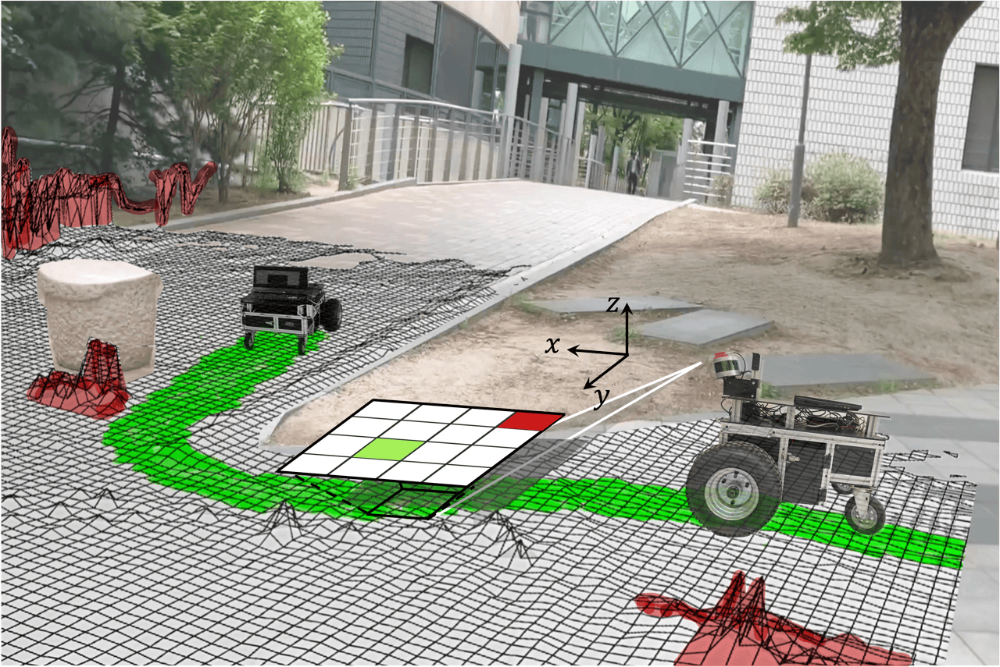

    <!-- Title -->
    <h1>LeSTA</h1>
    <h3>: Learning Self-supervised Traversability with Navigation Experiences of Mobile Robots</h3>
    
    
    
    
    

     
    

        💻 <a href="#installation">Installation</a> | 
        🎥 Video | 
        📖 <a href="https://ieeexplore.ieee.org/document/10468651">Paper</a> | 
        📁 <a href="https://github.com/Ikhyeon-Cho/urban-traversability-dataset">Dataset</a>
    

     
    

        
        
    

[LeSTA][paperlink] directly **learns robot-specific traversability in a self-supervised manner** by using a short period of manual driving experience.

[paperlink]:https://ieeexplore.ieee.org/document/10468651
[projectlink]:https://github.com/Ikhyeon-Cho/LeSTA
[datasetlink]:https://github.com/Ikhyeon-Cho/urban-traversability-dataset

---

## Installation in ROS

